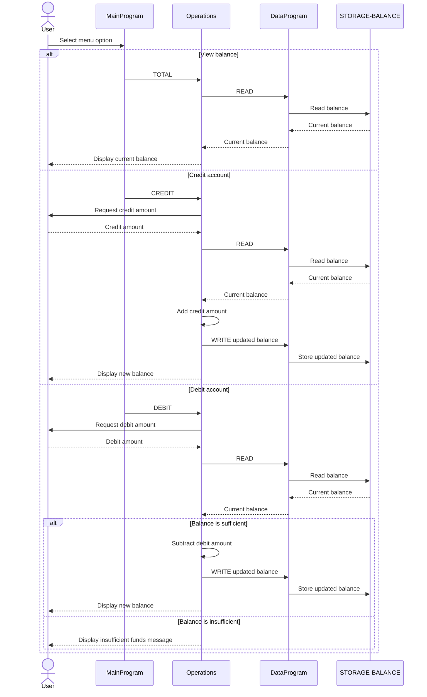

# COBOL Student Account System

This directory documents the COBOL programs in `src/cobol`. Together, they implement a console-based student account system that can display a balance, record credits, and record debits.

## Program Responsibilities

### `main.cob` - `MainProgram`

Provides the interactive menu and controls the application lifecycle.

Key logic:

- Repeats the menu until the user chooses option 4, **Exit**.
- Accepts menu options 1 through 4.
- Calls `Operations` with an operation code:
  - `TOTAL` followed by one space, to view the current balance.
  - `CREDIT` to add funds to the account.
  - `DEBIT` followed by one space, to subtract funds from the account.
- Displays an error for choices outside the supported range.

### `operations.cob` - `Operations`

Implements the student account actions requested by `MainProgram`.

Key logic:

- **TOTAL**: reads the stored balance through `DataProgram` and displays it.
- **CREDIT**: accepts a credit amount, reads the current balance, adds the amount, writes the new balance, and displays the result.
- **DEBIT**: accepts a debit amount, reads the current balance, and writes the reduced balance only when sufficient funds are available.
- Uses `DataProgram` with `READ` and `WRITE` commands to access the account balance.

### `data.cob` - `DataProgram`

Acts as the data-access layer for the student account balance.

Key logic:

- Stores the balance in `STORAGE-BALANCE`.
- Returns the stored balance when called with `READ`.
- Replaces the stored balance with the supplied value when called with `WRITE`.
- Receives the operation code and balance through the COBOL linkage section.

## Student Account Business Rules

- The account balance is initialized to `1000.00`.
- Account balances and transaction amounts use `PIC 9(6)V99`, allowing up to six whole-number digits and two decimal places; negative values are not represented by these fields.
- A credit increases the balance by the entered amount.
- A debit is allowed only when the current balance is greater than or equal to the requested amount.
- When a debit exceeds the available balance, no change is written and the program displays `Insufficient funds for this debit.`
- The system manages one in-memory balance only; it does not identify individual students or persist balances after the program ends.
- Menu operation codes use fixed six-character fields, so `TOTAL` and `DEBIT` each include a trailing space.

## Data Flow Sequence

